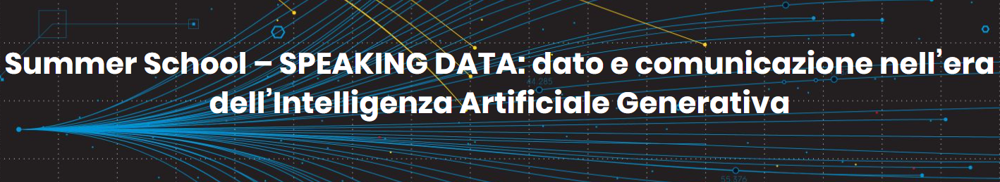

    

    <h3 align="center">
        Summer School - Speaking Data
    <h3>

<h1 align="center">
     Neural Networks Unveiled: From Perceptrons to Transformers
</h1>

## Course Description

This course offers a structured and accessible introduction to **Artificial Neural Networks (ANNs)**, guiding students through the fundamental concepts and architectures that form the basis of modern AI systems — including **Large Language Models (LLMs)** such as ChatGPT. The course is designed to help students understand how machines learn from data, and how this learning process evolves from recognizing handwritten digits to generating coherent, human-like text.

The course is divided into four main sections:

### 1. Context
We begin with the fundamental question: *why do we need neural networks?* Through concrete examples like handwritten digit recognition, we explore the limitations of rule-based systems and introduce the concept of learning from data. The section also highlights the importance of data representation and how neural networks learn internal transformations that simplify complex tasks.

### 2. Neural Networks: Core Concepts
This section introduces the building blocks of neural networks, from the perceptron to multi-layer architectures. Students will explore activation functions, loss functions, backpropagation, and the training process. Practical examples and code snippets — including hands-on experiments with datasets like MNIST — will reinforce these ideas.

### 3. Recurrent Neural Networks
Here, we examine the challenge of modeling **sequential data**, such as text or time series, and the need for memory-aware architectures. We introduce the Recurrent Neural Network (RNN), explain how it processes sequences over time, and touch on key limitations and enhancements such as Long Short-Term Memory (LSTM) networks.

### 4. Language Models
In the final section, we explore how modern AI systems process and generate language. We begin with tokenization and word embeddings, then introduce the limitations of RNN-based language models and the emergence of attention mechanisms. This leads to a detailed look at the **Transformer architecture**, the foundation of today’s state-of-the-art models like BERT and GPT. The section concludes with an overview of how models like ChatGPT are trained and applied in real-world scenarios.

---

**Author**: [Mauro Bruno](https://www.researchgate.net/profile/Mauro-Bruno-2)  
*Italian National Institute of Statistics (Istat)*

---

**By the end of the course**, students will have built a conceptual bridge from biological neurons to the architecture of LLMs — gaining both theoretical foundations and practical insights into how machines understand and generate language.

